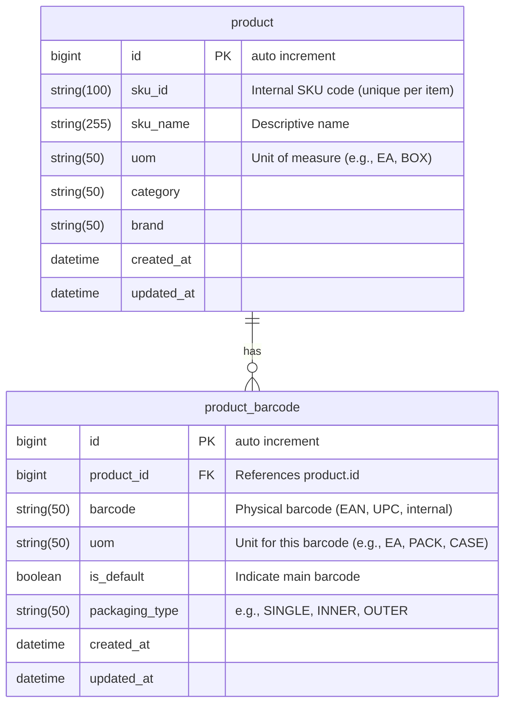
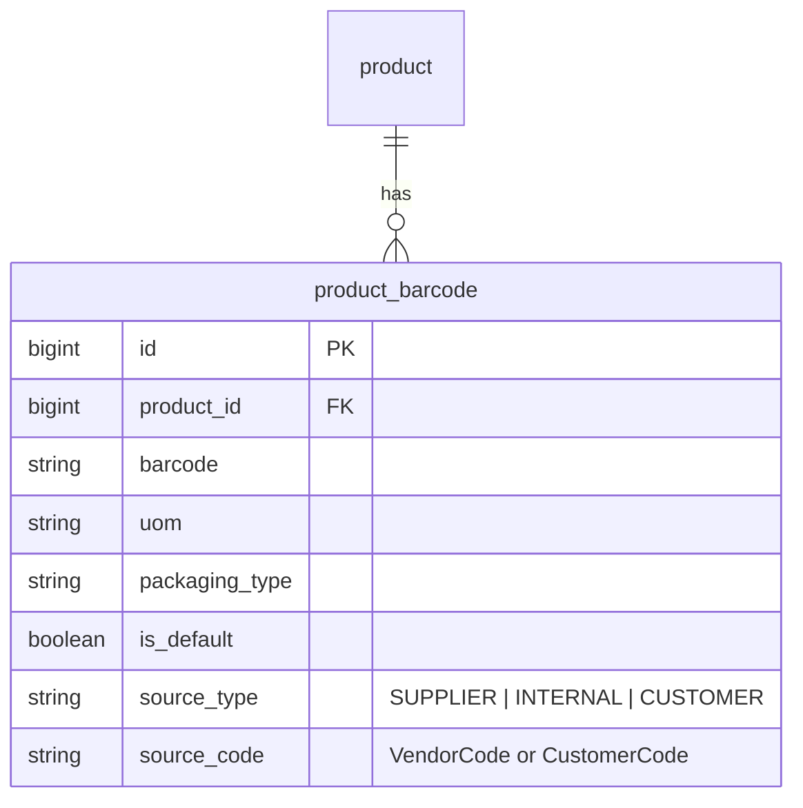

# ER Diagram: Product & Barcode Relationship

**Explanation**

| Table               | Description                                                                                                         |
| ------------------- | ------------------------------------------------------------------------------------------------------------------- |
| **product**         | Represents the **SKU master** — one row per logical item type (e.g., “Coca-Cola 330ml Can”).                        |
| **product_barcode** | Represents the **physical identification** of how that SKU appears in the warehouse (e.g., 1 can, 6-pack, 24-pack). |

### Optional Enhancements

