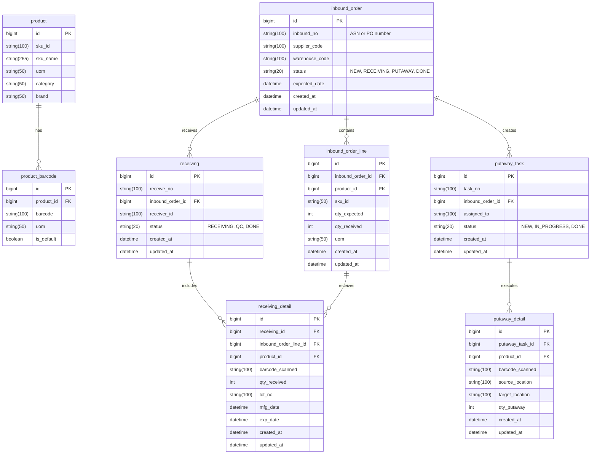

# Inbound

## Overview — Inbound Flow in WMS

Inbound flow is the process of receiving inventory into the warehouse.
It typically starts with a Purchase Order (PO) or Advanced Shipping Notice (ASN) and ends when items are stored in warehouse locations.

### Typical Process Flow

```
ASN / PO → Receiving → Putaway → Stock Update
```

### Main Entities in the Inbound Domain

| Entity                   | Description                                                                            |
| ------------------------ | -------------------------------------------------------------------------------------- |
| **InboundOrder / ASN**   | Header info for goods expected to arrive (from supplier, plant, or another warehouse). |
| **InboundOrderLine**     | Expected item lines (identified by `SkuId`).                                           |
| **Receiving**            | Physical receiving event when items actually arrive.                                   |
| **ReceivingDetail**      | Line-level data from scanning or weighing during receiving.                            |
| **PutawayTask**          | Instruction to move goods from staging area to a warehouse location.                   |
| **PutawayDetail**        | Record of the physical move confirmation.                                              |
| **InventoryTransaction** | The record of stock increase after goods are stored.                                   |

### Use Cases (Inbound Scenarios)

UC1: Create Inbound Order / ASN

Purpose: Notify WMS of incoming goods.
Triggered by: ERP / Supplier system.

Steps:

- ERP sends ASN/PO data to WMS (with SkuId, qty, expected date).

- WMS stores as inbound_order and inbound_order_line.

Data Focus:

- Uses SkuId

- No barcode interaction yet.

UC2: Receiving Execution

Purpose: Confirm actual goods received.

Steps:

- Operator scans barcode on each product.

- WMS looks up ProductBarcode.barcode → Product.sku_id.

- Match against expected SkuId in inbound_order_line.

- Records received qty in receiving_detail.

Data Focus:

- Uses Barcode for physical scanning.

- Validates SkuId for system integrity.

UC3: Quality Check (Optional)

Purpose: Inspect received goods before storing.

Steps:

- Quality inspector checks quantity, damage, expiration, etc.

- WMS updates line status: PENDING_QC, REJECTED, or APPROVED.

Data Focus:

- Works with SkuId

- Can store batch_no / lot_no / expiration_date

UC4: Putaway Task Creation

Purpose: Direct goods to storage locations.

Steps:

- WMS creates a putaway_task for each product.

- Assigns target location based on rules (ABC class, volume, product type).

Data Focus:

- Uses SkuId and location

UC5: Putaway Confirmation

Purpose: Physically store goods and confirm placement.

Steps:

- Operator scans barcode (item) and location barcode.

- WMS confirms ProductBarcode → SkuId and updates stock location.

Data Focus:

- Uses Barcode for physical scan

- Updates inventory for SkuId

UC6: Inventory Update

Purpose: Finalize stock addition.

Steps:

- System creates InventoryTransaction (IN movement).

- Updates stock balance table.

Data Focus:

- Transaction stored under SkuId

- May store reference to barcode for traceability.

### Data Flow Summary

| Stage                | Scan Input                 | Key Validation                   | Core Entities                         | Identifier Used |
| -------------------- | -------------------------- | -------------------------------- | ------------------------------------- | --------------- |
| ASN/PO Creation      | —                          | —                                | `inbound_order`, `inbound_order_line` | `SkuId`         |
| Receiving            | Product barcode            | `ProductBarcode → Product.SkuId` | `receiving`, `receiving_detail`       | `Barcode`       |
| Quality Check        | —                          | `SkuId`                          | `receiving_detail`                    | `SkuId`         |
| Putaway Task         | —                          | `SkuId`                          | `putaway_task`                        | `SkuId`         |
| Putaway Confirmation | Product + Location barcode | `Barcode` + `LocationCode`       | `putaway_detail`                      | `Barcode`       |
| Stock Update         | —                          | `SkuId`                          | `inventory_transaction`               | `SkuId`         |


### ER Diagram — Inbound Flow

