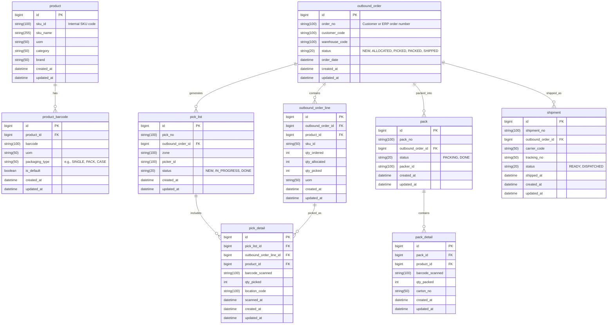

# Outbound

### Usage in WMS Flows

| Process                | Uses                                                                                     |
| ---------------------- | ---------------------------------------------------------------------------------------- |
| **Inbound receiving**  | Scan barcode → lookup product via `product_barcode.barcode` → identify `product.sku_id`. |
| **Picking / packing**  | Verify items by scanning barcodes that map back to SKU.                                  |
| **Inventory tracking** | Keep inventory by SKU (not by barcode).                                                  |
| **Label printing**     | Retrieve default barcode for outbound label.                                             |


## Typical Flow (High-Level)

Order → Allocation → Picking → Packing → Staging → Shipping

### Main Entities in Outbound Domain

| Entity                         | Description                                    |
| ------------------------------ | ---------------------------------------------- |
| **SalesOrder / OutboundOrder** | Represents a customer order to be fulfilled.   |
| **OutboundOrderLine**          | Item lines (linked to `SkuId`).                |
| **PickTask / PickList**        | Task assigned to operator for picking stock.   |
| **PickDetail**                 | Physical items picked (identified by barcode). |
| **Pack / Shipment**            | Packing confirmation and shipment creation.    |
| **InventoryTransaction**       | Movement record (decrease from warehouse).     |

### Detailed Use Cases

Here are the key use cases in outbound flow, with focus on how SkuId and Barcode are used differently.

### Order Release

Use case:
Customer order is created in ERP and sent to WMS.

Flow:

- ERP sends order with SkuId and quantity.

- WMS stores it in OutboundOrder and OutboundOrderLine.

- Allocation engine checks stock availability by SkuId.

Key data:

- Uses SkuId (system-level)

- No barcode used yet (no physical operation)

### Picking Task Generation

Use case:
- System creates pick tasks for operators.

Flow:

- Based on inventory locations and stock by SkuId.

- WMS generates PickList (warehouse zone, location, SKU, qty).

- Assigns to picker (manual or RF device).

Key data:

- Still SkuId-based

- Quantity in UOM (EA, BOX, CASE)

### Picking Execution (Scan and Confirm)

Use case:
- Picker scans barcode to confirm they picked the correct item.

Flow:

- Operator scans barcode.

- WMS looks up product using ProductBarcode.barcode → Product.sku_id.

- Validates it matches the assigned SKU.

- Confirms pick quantity and location.

- Updates InventoryTransaction (decrease from pick location).

Key data:

- Barcode used for validation

- SkuId used for inventory transaction

**Example**

```
Scanned barcode: 8851959132215 → maps to SKU12345
PickLine expects: SKU12345
✅ Match confirmed
```

### Packing

Use case:
- Picked items are packed into boxes/cartons.

Flow:

- Operator scans items again by barcode.

- WMS groups picked items into Pack or ShipmentCarton.

- Confirms total items per carton.

Key data:

- Barcode used for physical validation

- SkuId used for record linking and reporting


### Shipping Confirmation

Use case:
- Shipment leaves the warehouse.

Flow:

- Shipping label (contains shipment ID, carton barcode) is generated.

- Carrier pickup is confirmed.

- WMS marks order as shipped and pushes back confirmation to ERP.

Key data:

- New barcode for carton or shipment (not SKU barcode)

- SkuId summarized per shipment line for ERP reporting

### Example Data Flow

| Stage         | Input          | Scan | Validation Key                          | Output         |
| ------------- | -------------- | ---- | --------------------------------------- | -------------- |
| Order release | SkuId          | —    | —                                       | Outbound order |
| Pick task     | SkuId          | —    | SkuId                                   | PickList       |
| Picking       | Barcode        | ✅    | ProductBarcode.barcode → Product.sku_id | PickConfirm    |
| Packing       | Barcode        | ✅    | ProductBarcode.barcode → Product.sku_id | PackCarton     |
| Shipping      | Carton barcode | ✅    | Shipment.carton_barcode                 | ShipConfirm    |


### Design Pattern Summary

| Layer               | Entity                  | Identifier       | Reason                               |
| ------------------- | ----------------------- | ---------------- | ------------------------------------ |
| Master data         | Product                 | SkuId            | Logical identity                     |
| Physical item       | ProductBarcode          | Barcode          | Physical recognition                 |
| Order / transaction | OutboundOrderLine       | SkuId            | System-level transaction consistency |
| Operational scan    | PickDetail / PackDetail | Barcode          | Physical validation                  |
| Logistics           | Shipment / Carton       | Shipment barcode | Shipment tracking                    |

### Optional Enhancements

Multi-barcode matching:
Allow multiple barcodes per SKU (inner/outer packs).

Auto-quantity inference:
When scanning a carton barcode, automatically expand to multiple units.

Serial tracking:
Extend with SerialNumber entity if tracking unique items (electronics, medical, etc.).

RF device flow:
Implement scan-confirm via handheld terminal using REST APIs.

## ER Diagram — WMS Outbound Flow



### Explanation of Relationships

| Entity                | Purpose                     | Key Identifiers                | Uses                                |
| --------------------- | --------------------------- | ------------------------------ | ----------------------------------- |
| `product`             | Master data (logical item)  | `SkuId`                        | Internal product identity           |
| `product_barcode`     | Physical identifiers        | `Barcode`                      | For scanning during pick/pack       |
| `outbound_order`      | Outbound transaction header | `order_no`                     | Customer order info                 |
| `outbound_order_line` | Items in the order          | `SkuId`                        | Transaction-level product reference |
| `pick_list`           | Assigned picking tasks      | `pick_no`                      | Operator workflow                   |
| `pick_detail`         | Actual scan records         | `barcode_scanned`              | Barcode-level physical confirmation |
| `pack`                | Packing session             | `pack_no`                      | Containerization                    |
| `pack_detail`         | Items in each carton        | `barcode_scanned`, `carton_no` | Physical packing data               |
| `shipment`            | Shipment record             | `shipment_no`, `tracking_no`   | Outbound dispatch data              |


### Typical Flow Across Entities

| Step                   | Action               | Key Entities                            | Identifiers Used          |
| ---------------------- | -------------------- | --------------------------------------- | ------------------------- |
| 1. Order Created       | ERP → WMS            | `outbound_order`, `outbound_order_line` | `SkuId`                   |
| 2. Pick Task Generated | WMS allocates stock  | `pick_list`, `pick_detail`              | `SkuId`                   |
| 3. Picking Execution   | Operator scans item  | `pick_detail`                           | `Barcode → SkuId`         |
| 4. Packing             | Scan items to carton | `pack`, `pack_detail`                   | `Barcode → SkuId`         |
| 5. Shipment            | Ship carton          | `shipment`                              | `ShipmentNo / TrackingNo` |


### How Barcode and SkuId Interact

| Flow Stage         | Uses SkuId | Uses Barcode          |
| ------------------ | ---------- | --------------------- |
| Order / Allocation | ✅          | ❌                     |
| Picking            | ✅          | ✅ (scan validation)   |
| Packing            | ✅          | ✅ (scan confirmation) |
| Shipping           | ✅          | ✅ (carton barcode)    |

### Optional Extensions

You can easily extend this model for:

- Serial number tracking (serial_number table linked to pick_detail)

- Batch / lot tracking (lot_no field in pick/pack)

- Return / reverse logistics (return_order linked to shipment)

- Cross-docking (add crossdock_flag on order line)